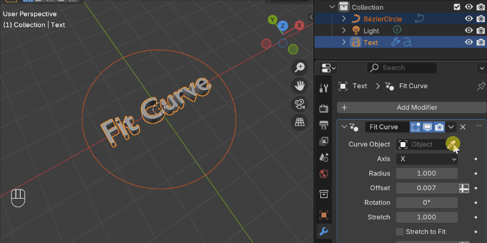

.. Fit Curve documentation master file, created by
   sphinx-quickstart on Mon Feb 17 13:16:15 2025.
   You can adapt this file completely to your liking, but it should at least
   contain the root `toctree` directive.

---------------------------------
What is Fit Curve?
---------------------------------

`Fit Curve <https://blendermarket.com/products/fit-curve/>`_ is a Blender modifier designed to provide an intuitive alternative to Blender’s built-in Curve Deform modifier. Unlike the standard approach, which can be confusing due to object-space transformations, Fit Curve ensures that objects align to curves in world space, making it easier to control and predict deformation.

Whether you're positioning text along a path, wrapping objects onto curves, or creating procedural designs, Fit Curve simplifies the process while offering powerful customization options.

---------------------------------
Why Use Fit Curve?
---------------------------------

Blender’s Curve Deform modifier requires careful object transformations to achieve correct results. Fit Curve removes this hassle by: 

* Ensuring predictable alignment in world space
* Providing easy-to-use controls for stretch, offset, and rotation
* Eliminating the need for manual adjustments and trial-and-error

This makes Fit Curve an ideal tool for artists, designers, and technical users who frequently work with curves in Blender.

---------------------------------
How It Works
---------------------------------

Follow the :ref:`How to Use<quick_start>` guide. Essentually:

#. Add Fit Curve to Your Asset Library  - Install the modifier asset to use it in any Blender project.
#. Apply the Modifier - Select an object and add *Deform - Fit Curve* from the modifier panel.
#. Choose a Curve - Select the *Curve Object*, and Fit Curve will automatically align your object.
#. Fine-Tune with Parameters - Adjust stretch, rotation, offset, and subdivisions for precise control.

---------------------------------
Contents
---------------------------------

.. toctree::
   :maxdepth: 1
   :caption: Contents:
   
   installation
   quick_start
   troubleshooting
   contact
