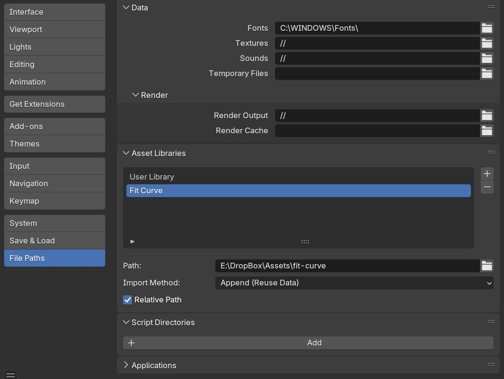

.. _installation:

#############
Installation
#############

*Fit Curve* is a **Modifier asset**, meaning it is installed as part of Blender’s **Asset Library** rather than a traditional add-on. Once set up, you should be able to access it directly from the **Deform** category in Blender’s modifier menu.

Step 1: Download the Files
--------------------------------

#. You will be provided with the following files:

    * ``fit_curve.blend``: This is the main file containing the modifier asset.

    * ``blender_assets.cats.txt``: This is the configuration file that tells Blender to add the modifier to the "Deform" modifier category.

#. Save these files together to a new folder where you want to store your **Blender Asset Library**.

Step 2: Set Up Your Asset Library in Blender
--------------------------------------------

If you haven’t already set up an **Asset Library**, follow these steps:

#. Open **Blender** and go to **Edit → Preferences**.
#. Navigate to the **File Paths** section.
#. Under **Asset Libraries**, click the **+** (*Add New*) button.
#. Name the library (e.g., “My Assets”) and select the folder where you saved the *Fit Curve* ``.blend`` file.
#. Click **Save Preferences**.

You can then follow the steps in :ref:`How to Use<quick_start>`.

.. _add_cat:

.. note:: 
   
   **Ensuring Fit Curve Appears in the Deform Modifier Category**

   By default, Blender **does not categorize custom modifier assets automatically**. 
   
   If *Fit Curve* appears in the **Unassigned** category instead of **Deform**, follow these steps to manually set the correct category inside Blender.

   #. Once downloaded to the directory you wish to keep the asset, open the fit-curve.blend file.

      .. image:: _static/images/add_cat.jpg
         :alt: Fit Curve Modifier

   #. In the Asset Browser window, click the '+' button to create a new asset catalog.  A new catalog will appear:

      .. image:: _static/images/add_cat2.jpg
         :alt: New Catalog

   #. Double click the new catalog to rename it.  Name it 'Deform':

      .. image:: _static/images/add_cat3.jpg
         :alt: Rename Catalog

   #. Drag the Fit Curve modifier from the 'Unassigned' category to the 'Deform' category:

      .. image:: _static/images/add_cat4.jpg
         :alt: Drag and Drop

   #. Save the .blend file and restart Blender to refresh the Asset Library.

