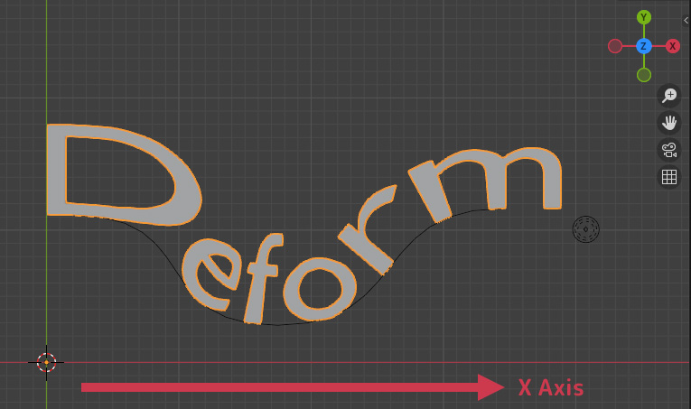

.. _quick_start:

#################
How to Use
#################

By default, Fit Curve moves the object along the curve using its X axis and origin point. This means the front of your object should face right (+X direction) when there is no rotation for it to follow the curve correctly. If your object moves sideways or looks wrong, try changing the *Axis* setting in the modifier panel or rotating the object in *Edit* mode.

.. note::

    For best results, make sure your object’s origin (pivot point) is in the center before using Fit Curve.  You can use *Object -> Set Origin -> Origin to Geometry* in the viewport menu

    Do send a message if you have any issues or questions via `info@configurate.net <mailto:info@configurate.net>`_.

Once you have :ref:`installed<installation>`, use *Fit Curve* as a **modifier** in Blender:

#. Select an object.
#. Open the **Modifiers tab** in the **Properties panel**.

    .. image:: _static/images/modifiers_tab.jpg
       :alt: Modifiers Tab
       
#. Click **Add Modifier → Deform → Fit Curve**.

    .. image:: _static/images/add_modifier.jpg
       :alt: Add Modifier

#. Pick a *Curve Object* in the modifier settings to align your object.

    .. image:: _static/images/curve_object_settings.jpg
       :alt: Curve Object

#. Adjust the **Offset**, **Rotation** and **Stretch** settings to fine-tune the alignment.

    .. image:: _static/images/modifier_change_settings.jpg
       :alt: Fit Curve Settings

Alternatively, you can add the modifier from the **Asset Browser**:

#. Open the **Asset Browser** (*Shift + F1* or use the Editor Type menu).
#. Select your **Asset Library** from the drop-down menu.
#. Locate *Fit Curve* in the **Deform** category.
#. **Drag and drop** the modifier onto an object.

Now, *Fit Curve* is ready to use.