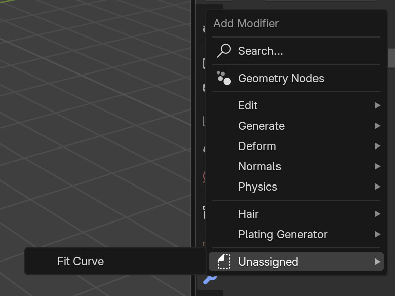
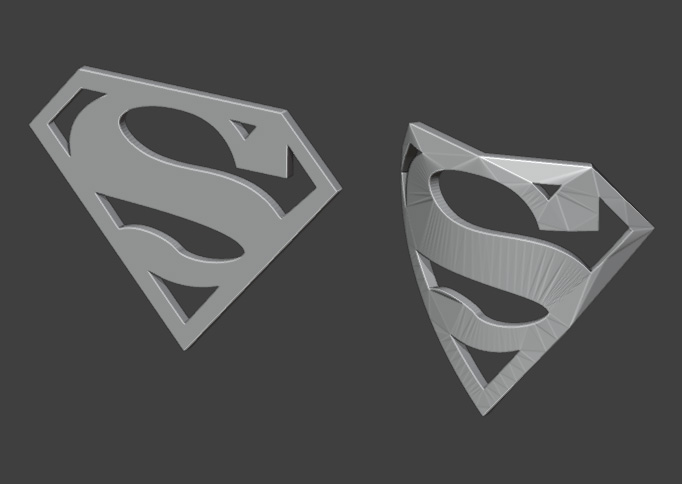
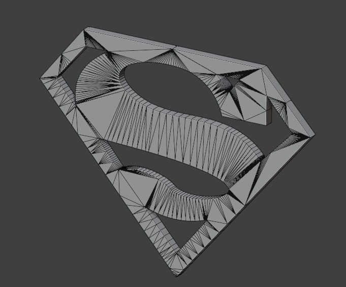
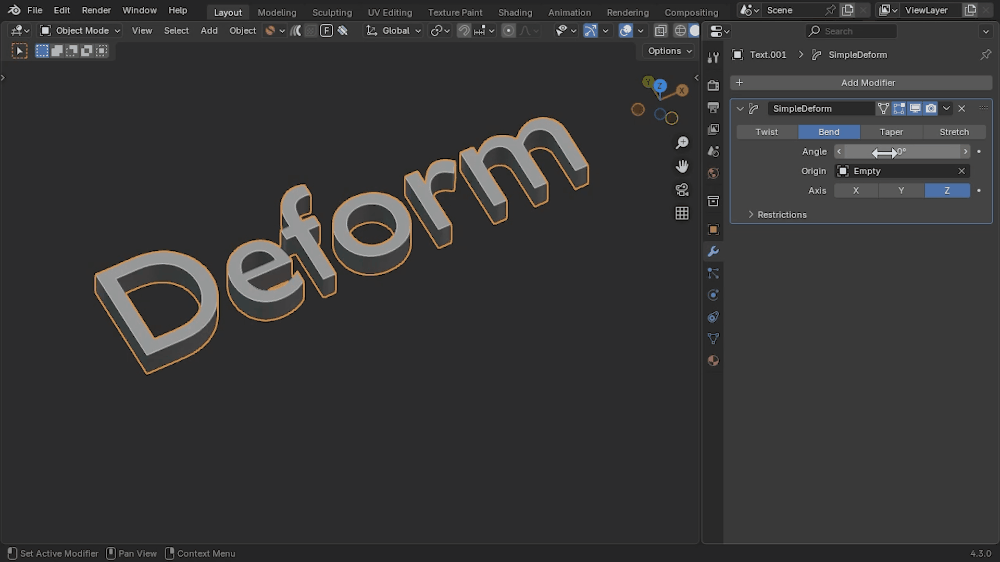
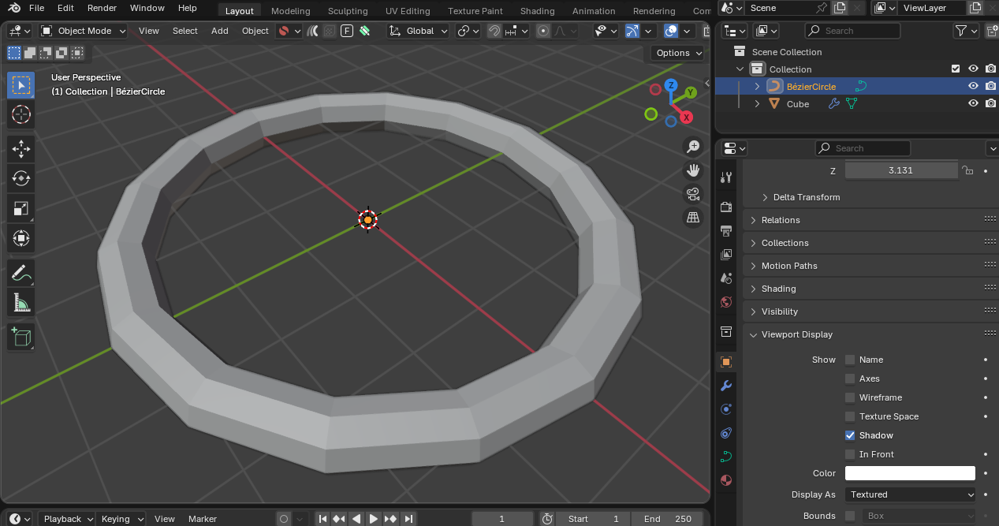
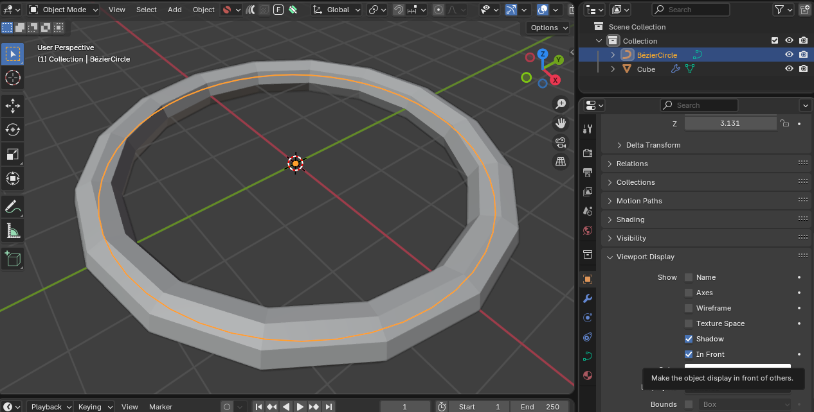
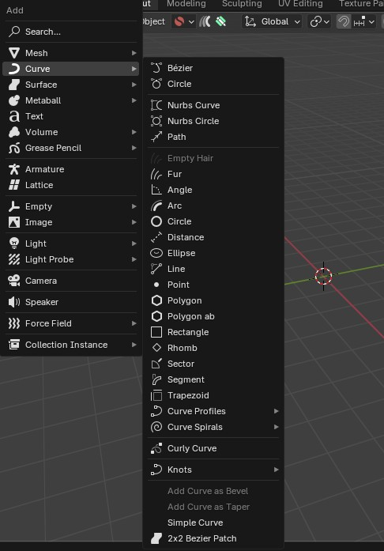
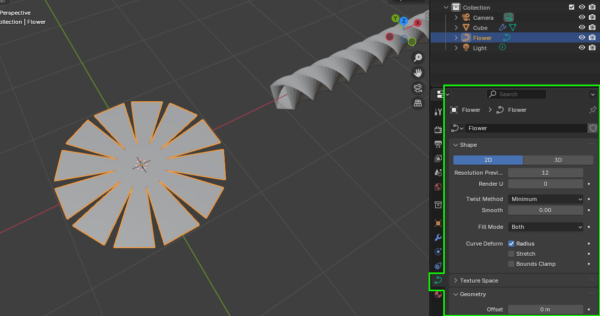
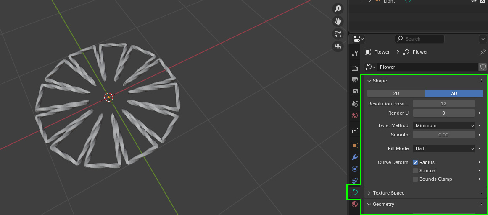
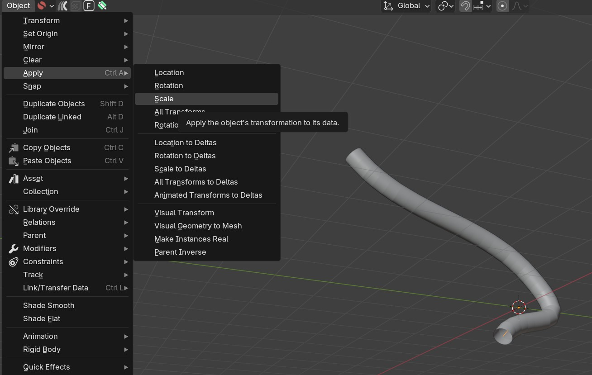

#####################################
Tips and Troubleshooting
#####################################

.. note::
    
    If you are having any issues do not hesitate to :ref:`Contact Us <contact>`

--------------------------------------------------------------------------------------
The modifier appears in the *Unassigned* category instead of *Deform*
--------------------------------------------------------------------------------------

By default, Blender does not categorize custom modifier assets automatically. If *Fit Curve* appears in the **Unassigned** category instead of **Deform**, follow  :ref:`these steps<add_cat>` to manually set the correct category inside Blender.

--------------------------------------------------------------------------------------
The modifier crashes Blender when I try to use it
--------------------------------------------------------------------------------------

This is likely due to the fact that the modifier is compatible with Blender 4.3.0 and above.  Make sure you are using the correct version of Blender and :ref:`Contact Us <contact>` if you are still having issues.

----------------------------------------------------------------------------------
When I distort an object, it can look distressed or triangulated.  Why?
----------------------------------------------------------------------------------

When you bend or stretch an 3D object, as with *Fit Curve*, the object's **topology** (or the edges and faces that make up the mesh) affects how well it deforms.

For best results, your object should have a **clean, evenly spaced, quad-based mesh**.

If your object is made of triangles or n-gons (faces with more than four sides), it may **bend strangely, stretch unevenly, or break apart.**

Quick Fix for Text & Logos
--------------------------

If you're trying to curve **text or a logo**, a fast way to improve the topology is:

#. Add a **Remesh Modifier** to your object.
#. Set it to **Sharp** mode.
#. **Untick** *Remove Disconnected* (so letters don’t merge).
#. Increase **Octree Depth** to add more detail.

.. warning::
   This method increases geometry, making your file heavier.

Better Long-Term Solutions
--------------------------

For **good deformations**, consider:

* **Manual Retopology** – Redrawing the mesh with nice, even quads. My other add-on, `Quad Maker <https://blendermarket.com/products/quad-maker?ref=361>`_, may help.  
* **Subdivision Modifier** – Adds more geometry for smoother bending.  
* **Remeshing in an External Program** – Software like Instant Meshes or RetopoFlow can help.  

With a good mesh, *Fit Curve* will work much better.

--------------------------------------------------------------------------------------
I can't see the curve to edit when the modifier is applied
--------------------------------------------------------------------------------------

When you add the *Fit Curve* modifier, the curve object may disappear from view. This is because the curve is being used as the deforming object and is occluded from view.

With the curve object selected, you can go to the Object properties panel and enable the **In Front** option under the *Viewport Display* section: 

This will make the curve visible in front of other objects, allowing you to see and edit it more easily.

--------------------------------------------------------------------------------------
Using more curves with the *Add Curve: Extra Objects* Add-on
--------------------------------------------------------------------------------------

Blender has a built-in add-on called **Add Curve: Extra Objects** that provides additional curve types, such as spirals, superellipses, and more.

To enable it:

#. Go to **Edit → Preferences → Add-ons**.
#. Search for **Add Curve: Extra Objects**.
#. Enable the add-on by checking the box.
#. Now, when you press **Shift + A → Curve**, you’ll see more curve options!

.. tip::
   Make sure '3D' is selected when creating new curve objects.

------------------------------------------------------------------------------------
When selecting a curve, that curve appears solid and does not appear to work.
------------------------------------------------------------------------------------

This may be that the Curve Shape is set to *2D* and not *3D*, which can be changed by going to the Curve properties tab and selecting *3D* instead of *2D* in the settings:

--------------------------------------------------------------------------------------
When I scale a curve, the result seems stretched.  How do I fix this?
--------------------------------------------------------------------------------------

When you scale the curve in regular object, it is stretching the curve's "global" coordinates which will also distort the mesh.

.. image:: _static/images/scale_deform.gif
   :alt: Troubleshooting

To fix this, you can apply the scale to the curve by selecting it, and under the *Object* viewport menu select *Apply -> Scale*:

--------------------------------------------------------------------------------------
A question or issue I have is not covered here.
--------------------------------------------------------------------------------------

Please do not hesitate to :ref:`Contact me <contact>` if you have any questions or issues.  I am here to help you get the most out of *Fit Curve*.